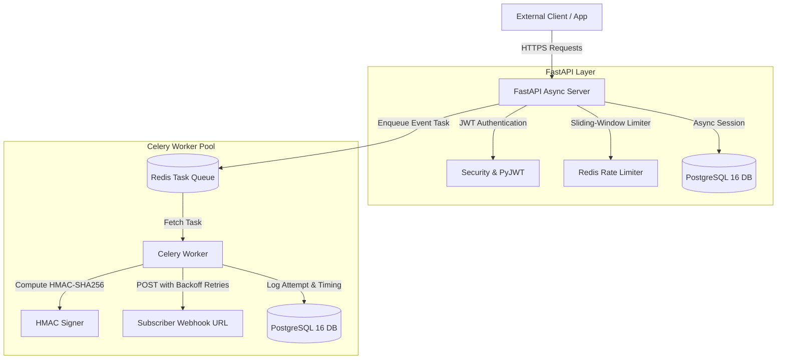

# Async Webhook Engine

[](https://www.python.org/)
[](https://fastapi.tiangolo.com/)
[-D71F00.svg?style=flat&logo=sqlalchemy&logoColor=white)](https://www.sqlalchemy.org/)
[](https://docs.celeryq.dev/)
[](https://redis.io/)
[](https://www.postgresql.org/)
[](https://www.docker.com/)
[](LICENSE)

A production-grade, highly scalable asynchronous webhook delivery engine built in Python 3.12. Demonstrates core backend engineering fundamentals including non-blocking I/O with **FastAPI**, distributed task processing with **Celery** & **Redis**, asynchronous database persistence with **SQLAlchemy 2.0 (asyncpg)**, cryptographic **HMAC-SHA256** payload verification, Redis sliding-window rate limiting, and containerized deployment with **Docker Compose**.

---

## 🏛 System Architecture



### Core Request & Dispatch Lifecycle
1. **Target Registration:** Clients register webhook endpoints, specify subscribed event types (e.g. `order.created`, `user.signup`, or `*`), and receive an HMAC secret signing token.
2. **Event Trigger:** An external system triggers an event payload via `POST /api/v1/webhooks/trigger`.
3. **Task Queuing:** FastAPI queries matching active endpoints and pushes discrete background dispatch tasks to Redis.
4. **HMAC Signing:** The Celery worker computes an `HMAC-SHA256` digest of the JSON payload and attaches it to the `X-Webhook-Signature` header along with timestamp and unique delivery ID.
5. **Resilient HTTP Dispatch:** The worker sends an HTTP POST request to the subscriber. If the endpoint returns a non-2xx status code or times out, the task automatically retries with exponential backoff delays (`5s`, `15s`, `45s`).
6. **Telemetry & Audit Logging:** Every dispatch attempt (including response status code, payload, duration in milliseconds, attempt count, and error details) is persisted to PostgreSQL.

---

## 🚀 Key Features & Engineering Highlights

- **Modern Asynchronous Python:** Built on Python 3.12 using FastAPI and native `async`/`await` for optimal I/O concurrency.
- **SQLAlchemy 2.0 Async ORM:** Fully type-annotated models using `Mapped[]` and `mapped_column()`, powered by `asyncpg` connection pools.
- **Distributed Background Workers:** Celery 5.x with Redis broker, task retries, late acknowledgment (`acks_late`), and graceful connection recycling.
- **Cryptographic Security:**
  - Password hashing using `bcrypt`.
  - JWT token authentication (`PyJWT`).
  - Webhook payload integrity verified via `HMAC-SHA256` signatures (`X-Webhook-Signature`).
- **Redis Sliding-Window Rate Limiter:** Protects dispatch and auth endpoints using Redis sorted sets (`ZSET`), with seamless open-fail fallback.
- **Automated Database Migrations:** Fully configured async Alembic setup with pre-baked baseline migration.
- **Robust Test Suite:** Comprehensive functional tests using `pytest`, `pytest-asyncio`, and `httpx.AsyncClient` with in-memory SQLite and isolated mock fixtures.
- **Production Containerization:** Multi-stage `Dockerfile` (non-root execution) and unified `docker-compose.yml` orchestrating API, Celery worker, PostgreSQL, and Redis.

---

## 📂 Project Structure

```
async-webhook-engine/
├── app/
│   ├── __init__.py
│   ├── main.py               # FastAPI entry point, lifespan events, middleware
│   ├── config.py             # Pydantic Settings (env variables, DB/Redis URLs)
│   ├── database.py           # Async engine, sessionmaker, Base model
│   ├── models/               # SQLAlchemy models (User, WebhookTarget, WebhookLog)
│   │   ├── __init__.py
│   │   ├── user.py
│   │   └── webhook.py
│   ├── schemas/              # Pydantic v2 validation models
│   │   ├── __init__.py
│   │   ├── auth.py
│   │   └── webhook.py
│   ├── api/                  # API routers & endpoints
│   │   ├── __init__.py
│   │   ├── deps.py           # Auth dependencies & DB session providers
│   │   ├── auth.py           # Login / register / JWT token generation
│   │   └── webhooks.py       # CRUD for webhook targets & dispatch triggers
│   ├── tasks/                # Celery background workers
│   │   ├── __init__.py
│   │   ├── celery_app.py     # Celery configuration with Redis broker/backend
│   │   └── worker.py         # Async HTTP dispatch task with exponential retries
│   └── utils/
│       ├── __init__.py
│       ├── security.py       # Password hashing, JWT & HMAC signing
│       └── rate_limiter.py   # Redis sliding-window rate limiter
├── tests/
│   ├── __init__.py
│   ├── conftest.py           # Async client fixtures, test DB setup
│   ├── test_auth.py          # Authentication endpoint tests
│   └── test_webhooks.py      # Webhook CRUD & dispatch tests
├── alembic/                  # Database migrations setup
│   ├── env.py                # Async Alembic runner
│   ├── script.py.mako
│   └── versions/
│       └── 0001_initial.py   # Baseline schema migration
├── alembic.ini
├── Dockerfile                # Production multi-stage Dockerfile
├── docker-compose.yml        # Orchestrates API, Worker, PostgreSQL, Redis
├── requirements.txt          # Pinned Python dependencies
├── .env.example              # Sample environment configuration
└── README.md
```

---

## 🛠 Quickstart Guide

### Prerequisites
- [Docker](https://docs.docker.com/get-docker/) & [Docker Compose](https://docs.docker.com/compose/) installed, **OR**
- Python 3.12+, PostgreSQL, and Redis installed locally.

---

### Option A: Run via Docker Compose (Recommended)

1. **Clone the repository:**
   ```bash
   git clone https://github.com/yourusername/async-webhook-engine.git
   cd async-webhook-engine
   ```

2. **Launch all services:**
   ```bash
   docker-compose up --build
   ```

3. **Verify running containers:**
   - **FastAPI API & Docs:** [http://localhost:8000/docs](http://localhost:8000/docs)
   - **Health Check:** [http://localhost:8000/health](http://localhost:8000/health)
   - **Celery Worker:** Automatically running and consuming from Redis queue.

---

### Option B: Local Virtual Environment Setup

1. **Create and activate a virtual environment:**
   ```bash
   python -m venv venv
   # Linux/macOS
   source venv/bin/activate
   # Windows
   .\venv\Scripts\activate
   ```

2. **Install dependencies:**
   ```bash
   pip install -r requirements.txt
   ```

3. **Configure Environment:**
   ```bash
   cp .env.example .env
   # Adjust DATABASE_URL, REDIS_URL, and SECRET_KEY as needed
   ```

4. **Run database migrations:**
   ```bash
   alembic upgrade head
   ```

5. **Start FastAPI web server:**
   ```bash
   uvicorn app.main:app --host 0.0.0.0 --port 8000 --reload
   ```

6. **Start Celery worker in a separate terminal:**
   ```bash
   celery -A app.tasks.celery_app.celery_app worker --loglevel=info --concurrency=4
   ```

---

## 📖 API Usage & Examples

### 1. Register a User
```bash
curl -X POST http://localhost:8000/api/v1/auth/register \
  -H "Content-Type: application/json" \
  -d '{"email": "developer@example.com", "password": "SecurePassword123!"}'
```

### 2. Log in and Retrieve JWT Token
```bash
curl -X POST http://localhost:8000/api/v1/auth/login \
  -H "Content-Type: application/json" \
  -d '{"email": "developer@example.com", "password": "SecurePassword123!"}'
```
*Response:*
```json
{
  "access_token": "eyJhbGciOiJIUzI1NiIsInR5cCI6IkpXVCJ9...",
  "token_type": "bearer"
}
```

### 3. Register a Webhook Target
```bash
curl -X POST http://localhost:8000/api/v1/webhooks \
  -H "Authorization: Bearer <YOUR_ACCESS_TOKEN>" \
  -H "Content-Type: application/json" \
  -d '{
    "name": "Billing Service Hook",
    "target_url": "https://webhook.site/your-unique-uuid",
    "subscribed_events": ["invoice.paid", "order.created"]
  }'
```
*Response:*
```json
{
  "id": 1,
  "user_id": 1,
  "name": "Billing Service Hook",
  "target_url": "https://webhook.site/your-unique-uuid",
  "secret_token": "9a38f7e2d9b4c018a45f9e2...",
  "subscribed_events": ["invoice.paid", "order.created"],
  "is_active": true,
  "created_at": "2026-08-24T12:00:00Z",
  "updated_at": "2026-08-24T12:00:00Z"
}
```

### 4. Trigger an Event Dispatch
```bash
curl -X POST http://localhost:8000/api/v1/webhooks/trigger \
  -H "Authorization: Bearer <YOUR_ACCESS_TOKEN>" \
  -H "Content-Type: application/json" \
  -d '{
    "event_type": "invoice.paid",
    "payload": {
      "invoice_id": "INV-2026-0042",
      "amount": 2500.00,
      "currency": "USD",
      "customer_id": "cust_8829"
    }
  }'
```

### 5. Inspect Webhook Delivery Logs
```bash
curl -X GET http://localhost:8000/api/v1/webhooks/1/logs \
  -H "Authorization: Bearer <YOUR_ACCESS_TOKEN>"
```

---

## 🔒 HMAC-SHA256 Signature Verification

Every outbound webhook delivery includes the following security headers:
- `X-Webhook-Signature`: The hex-encoded HMAC-SHA256 digest of the request body.
- `X-Webhook-Event`: The event topic (e.g. `invoice.paid`).
- `X-Webhook-Timestamp`: Unix epoch timestamp when the webhook was generated.
- `X-Webhook-Delivery-Id`: Unique UUID for tracking and deduplication.

### Subscriber Verification Example (Python)
```python
import hashlib
import hmac
import json
from fastapi import FastAPI, Header, HTTPException, Request

app = FastAPI()
WEBHOOK_SECRET = "your_registered_secret_token"

@app.post("/webhook-receiver")
async def receive_webhook(
    request: Request,
    x_webhook_signature: str = Header(...),
    x_webhook_event: str = Header(...),
):
    raw_body = await request.body()
    
    # Compute expected signature
    expected_sig = hmac.new(
        WEBHOOK_SECRET.encode("utf-8"),
        msg=raw_body,
        digestmod=hashlib.sha256
    ).hexdigest()
    
    # Constant-time comparison to prevent timing attacks
    if not hmac.compare_digest(expected_sig, x_webhook_signature):
        raise HTTPException(status_code=401, detail="Invalid HMAC signature")
        
    payload = json.loads(raw_body)
    print(f"Received verified event '{x_webhook_event}':", payload)
    return {"status": "accepted"}
```

### Subscriber Verification Example (Node.js / Express)
```javascript
const express = require('express');
const crypto = require('crypto');

const app = express();
app.use(express.raw({ type: 'application/json' }));

const WEBHOOK_SECRET = 'your_registered_secret_token';

app.post('/webhook-receiver', (req, res) => {
  const signature = req.headers['x-webhook-signature'];
  const expectedSig = crypto
    .createHmac('sha256', WEBHOOK_SECRET)
    .update(req.body)
    .digest('hex');

  const trusted = crypto.timingSafeEqual(
    Buffer.from(signature || '', 'hex'),
    Buffer.from(expectedSig, 'hex')
  );

  if (!trusted) {
    return res.status(401).json({ error: 'Invalid HMAC signature' });
  }

  const payload = JSON.parse(req.body.toString());
  console.log('Verified webhook received:', payload);
  res.status(200).json({ status: 'accepted' });
});
```

---

## 🧪 Testing

The project includes functional test coverage for authentication, webhook registration, cross-user isolation, event dispatch, and HMAC signature algorithms.

```bash
# Run pytest with verbose output
pytest -v

# Run with test coverage report
pytest --cov=app --cov-report=term-missing
```

---

## 📄 License
Distributed under the MIT License. See `LICENSE` for more information.
